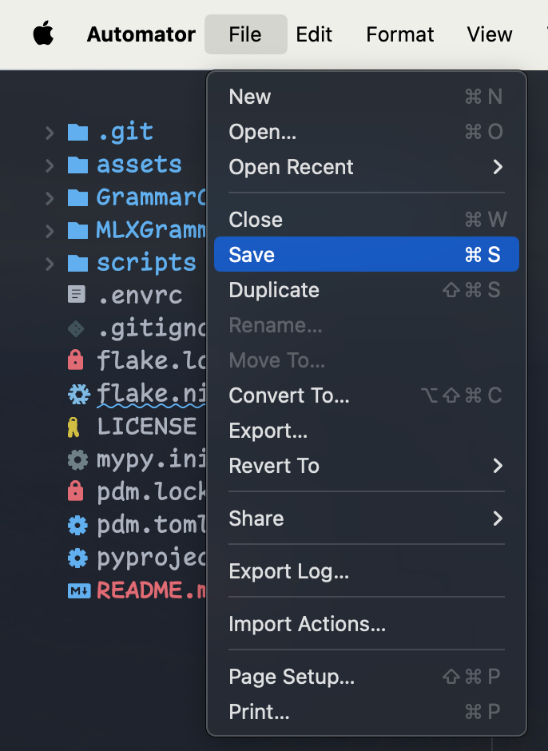

# Autogram


Correct spelling and grammar by highlighting text and using a keyboard shortcut.

This tool only works for Apple Silicon devices. Powered by Automator with Ollama + Gemini or Apple MLX as backend. Open, free, easy and fast! Play, copy, fork, experiment, have fun!

This is forked from [Autogram](https://github.com/ivanfioravanti/autogram) with the following changes:

- Uses `pdm` for Python package management
- Uses a bash script in Automator to call Python scripts. You can modify Python code in the `scripts` folder instead of in the workflow
- Generate responses from both the Gemini and Ollama models, allow the user to pick which one they prefer
- Improves the prompt using Gemini
- Experiments with MLX GGUF model

The main tool will give corrected text from both Ollama and Gemini for comparison and choose which is the best for you.

An example of refined text from the above message:

>
    The main tool will provide corrected text from both Ollama and Gemini for comparison, allowing you to select the option that best suits your needs.
    ------
    The primary tool provides a comparison of corrected texts generated by Ollama and Gemini, allowing you to select the most suitable option for your needs.

## Setup

- Install [ollama](https://ollama.ai/)
- Install [pdm](https://pdm-project.org/latest/#installation). If you are using nix, check [Nix users](## Nix users)
- Clone the repo and install dependencies

```sh
gh repo clone sandangel/autogram && cd autogram
```

```sh
pdm install
```

- Gemini: Generate an API key at: https://makersuite.google.com/

- Ollama: Pull the model from the Ollama registry

```sh
ollama pull starling-lm:7b-alpha-q4_K_M
```

## Install workflow

Before installing, right click and choose Open with Automator to edit the workflow.


Add your Gemini API KEY, update paths to `site-packages` in your `.venv` folder and Python executable.


Save the workflow




To install the GrammarChecker workflow:

1. Double click on the .workflow file to install it.

2. Go to System Preferences -> Keyboard -> Shortcuts -> Services -> Text -> GrammarChecker.

3. Set a keyboard shortcut for the workflow, for example `⌃⌥⌘S`.

## Usage

1. In any macOS application, highlight the text you want to modify.

2. Press the keyboard shortcut you assigned to the GrammarChecker workflow in System Preferences.

3. The highlighted text will be replaced with corrected text generated by the AI model.

Ollama has the option to retain the AI model in memory after use, allowing for faster query response times on subsequent requests. This feature is currently set to last for one hour.

## Apple MLX Backend

The MLXGrammarChecker workflow can be installed the same way as the other workflows.

Note that this workflow uses an experimental MLX model, which should be faster but needs to load the model weights into memory on each call. So it may take more time compared to the Gemini + Ollama workflows.

The MLXGrammarChecker workflow is based on the Qwen/Qwen1.5-14B-Chat model.

## Roadmap

- Implement a popup dialog to allow the user to select either the Ollama or Gemini generated text, instead of inserting both options into the document.
- Making MLX workflow faster for daily use.
- Easier to install by auto detecting `site-packages` in pdm.

## Nix users

- Run `nix develop --impure .` to install `pdm`.
- If you are using direnv + nix, Please add the layout_pdm below to your direnv config

```sh
layout_pdm() {
    if has pdm; then
        # create venv if it doesn't exist
        if [[ ! -d .venv ]]; then
            pdm venv create
        fi

        if [[ ! -f pyproject.toml ]]; then
            echo 'No pyproject.toml found. Use `pdm init` to create one first.'
            pdm init
        fi

        if [[ "$VIRTUAL_ENV" == "" ]]; then
            pdm use -q --venv in-project
            eval $(pdm venv activate in-project)

            export VIRTUAL_ENV=$(pwd)/.venv
            export PYTHONPATH=$VIRTUAL_ENV/lib/$(command ls $VIRTUAL_ENV/lib | head -1)/site-packages:$PYTHONPATH
            PATH_add "$VIRTUAL_ENV/bin"
        fi
    fi
}
```

## Credits
Original idea [LLM-Automator](https://github.com/radames/LLM-automator) [Radamés Ajna](https://github.com/radames)

Forked from [Autogram](https://github.com/ivanfioravanti/autogram)
