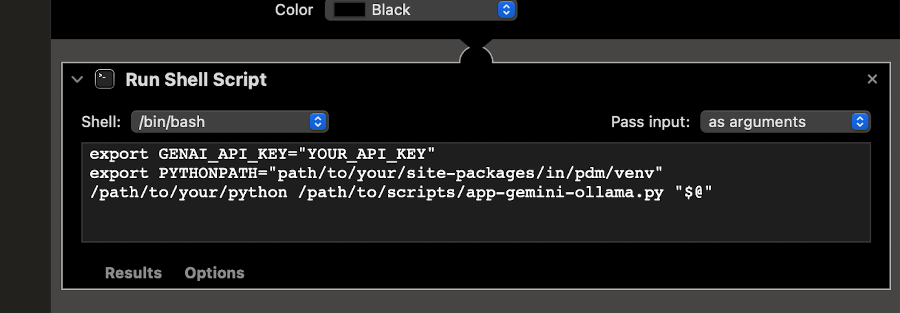

# Autogram

Grammar checker for Apple Silicon devices powered by Automator with Ollama + Gemini or Apple MLX as backend.
Open, free, easy and fast!
Play, copy, fork, experiment, have fun!

The main tool will give answer from both Ollama and Gemini for comparison and choose which is the best for you.

Example rephrased text from the above message:

> The primary tool will provide responses from both Ollama and Gemini for comparison, enabling you to select the optimal option for your needs.

> ------

> The primary tool provides answers from both Ollama and Gemini for comparison, allowing you to determine the most suitable option.

## Setup

- Install [ollama](https://ollama.ai/)
- Install [pdm](https://pdm-project.org/latest/#installation). If you are using nix, just need to run `nix develop --impure .`
    - If you are using direnv + nix, Please add the layout_pdm below to your direnv config

```sh
        layout_pdm() {
            if has pdm; then
                # create venv if it doesn't exist
                if [[ ! -d .venv ]]; then
                    pdm venv create
                fi

                if [[ ! -f pyproject.toml ]]; then
                    echo 'No pyproject.toml found. Use `pdm init` to create one first.'
                    pdm init
                fi

                if [[ "$VIRTUAL_ENV" == "" ]]; then
                    pdm use -q --venv in-project
                    eval $(pdm venv activate in-project)

                    export VIRTUAL_ENV=$(pwd)/.venv
                    export PYTHONPATH=$VIRTUAL_ENV/lib/$(command ls $VIRTUAL_ENV/lib | head -1)/site-packages:$PYTHONPATH
                    PATH_add "$VIRTUAL_ENV/bin"
                fi
            fi
        }
```

- Install dependencies

```python
pdm install
```

- Gemini: Generate a Bard API key at: https://makersuite.google.com/

- Ollama: Pull the model from the Ollama registry

```sh
ollama pull starling-lm:7b-alpha-q4_K_M
```

## Install workflow

Edit the workflow, adding your Gemini API KEY and site-packages path.




To install the GrammarChecker workflow:

1. Double click on the .workflow file to install it.

2. Go to System Preferences -> Keyboard -> Shortcuts -> Services -> Text -> GrammarChecker.

3. Set a keyboard shortcut for the workflow, for example `⌃⌥⌘S`.

## Usage

1. In any macOS application, highlight the text you want to rephrase.

2. Press the keyboard shortcut you assigned to the Autogram workflow in System Preferences.

3. The highlighted text will be replaced with rephrased text generated by the AI model.

Ollama has an option to keep the AI model loaded in memory after use for faster startup times on subsequent launches. Currently, this is set to 1 hour.

## Apple MLX Backend

The MLXGrammarChecker workflow can be installed the same way as the other workflows.

Note that this workflow uses an experimental MLX model, which should be faster but needs to load the model weights into memory on each call. So it may take more time compared to the Gemini or Ollama workflows.

The MLXGrammarChecker workflow is based on the Qwen/Qwen1.5-14B-Chat model.

## Roadmap

- Implement a popup dialog to allow the user to select either the Ollama or Gemini generated text, instead of inserting both options into the document.

## Credits
Original idea [LLM-Automator](https://github.com/radames/LLM-automator) [Radamés Ajna](https://github.com/radames)
This is forked from [Autogram](https://github.com/ivanfioravanti/autogram) with the following changes:

- Uses pdm for Python package management
- Uses a bash script in Automator to call Python scripts instead of modifying in the workflow
- Adds support for Gemini model
- Improves the prompt using Gemini
- Experiments with MLX GGUF model
